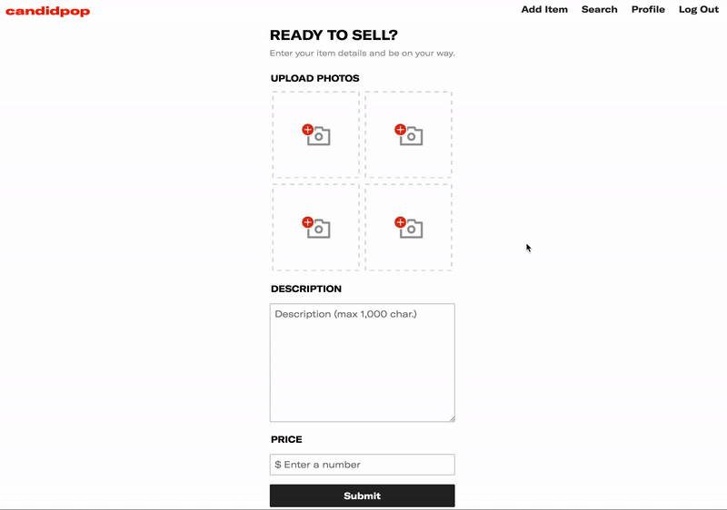
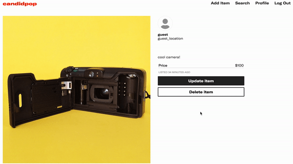
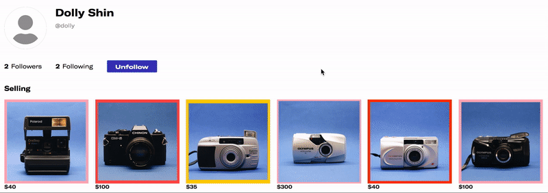

# Candidpop

<p width="100%" align="center">
  
</p>

---

[Visit Candidpop Now!](https://candidpop.herokuapp.com)

Candidpop is an upcoming reselling app designed to help photographers buy and sell gear, easily. Post items to sell and browse items being sold by others! Candidpop is inspired by [Depop](https://www.depop.com).

The project was built in 10 days, and a list of additions will be used for future development.

---

## Technologies

Candidpop is built on a Ruby on Rails backend and utilizes a PostgreSQL database which interfaces with Rails ActiveStorage and Amazon S3. The frontend is built using React and Redux as a single-page application. Components update dynamically following user input.

---

## Features

- Users can browse a feed of items for sale (pictured above)
- Users can add their own items to sell on the marketplace
  - Users can upload images for their for-sale items which are displayed on the marketplace feed
- Users can search the marketplace against item descriptions provied by sellers
- Users can update their listings and delete an existing item from the marketplace
- Users can purchase other items, thus removing them from the marketplace
- Users can follow one another as well as view each user's followers/following

---

### Add Item Form

- The Add Item form is accessible to a logged-in user. Here, a user can upload (up to four) images and provide some information for the item they are selling. As users select photo files from their device, thumbnails will render dynamically, even if a different photo is selected after the fact.

```javascript
// render JSX
<div className='item-photo-holder'>
  
  <input type="file" onChange={this.handleFile1}/>
</div>

// handleFile1 handles both the file to be sent to S3 and the frontend thumbnail
handleFile1(e) {
  this.setState({file1: e.currentTarget.files});
  this.setState({file1Url: URL.createObjectURL(e.target.files[0])}); // from Egor Egorov @650egor on Medium
}
```

<p width="700" align="center">
  
</p>

---

### Sign Up Form

- Similar to the Add Item form, profile pictures uploaded dynamically show a preview inside a circular frame with the option for reselecting a different file from the user's device.

```javascript
// render JSX
<div className='add-pic-button'>
  
  <input type='file' onChange={this.handleFile} />
</div>
```

<p width="600" align="center">
  
</p>

---

### Items CRUD

- Users can create, view, update, and delete items in the site's database.
  - Any item in the site's database is visible on the homepage
  - Each item has it's own view page:
    - When viewing another user's item an option to "Buy now" is seen which deletes the item from the database
    - When viewing one's own item an option to update is visible which prompts a form to appear containing the item info
    - When viewing one's own item an option to delete the item completely is also visible
    - Any logged in user will have access to a create item link where they can add information for an item they'd like to sell


<p width="600" align="center">
  
</p>

---

### Follows

- A user's show page lists their follower/following count
  - Clicking these reveal a list of their followers/following
- The user and their followers/following can be followed and unfollowed from this page


<p width="100%" align="center">
  
</p>

---

### Future Additions

Some features I would like to implement in the future include:
- Access history of items you have purchased
- Access history of items you have sold
- Reviews/ratings which average into a score out of 5 for each user

---

### Made By
Owen Haupt - [Github](https://github.com/owenshaupt) | [LinkedIn](https://www.linkedin.com/in/owenshaupt/) | [Portfolio](https://owenhaupt.io/)
